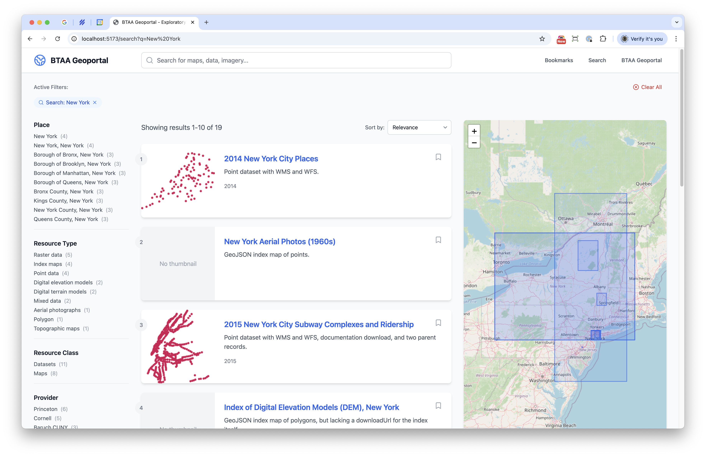

# rui
React UI for our exploratory data api



## Development

Install dependencies:
```bash
npm install
```

Configure the database:
```bash
cp .env.example .env
```

Run the server:
```bash
npm run dev
```
